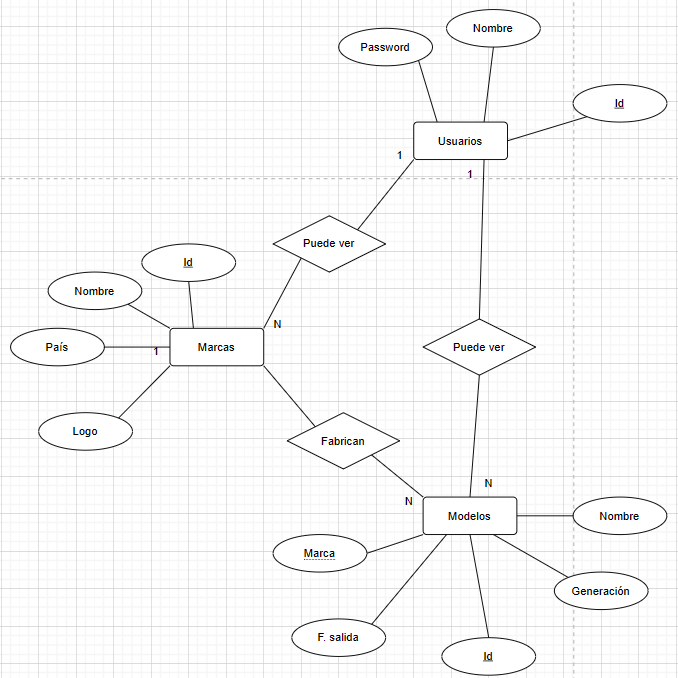
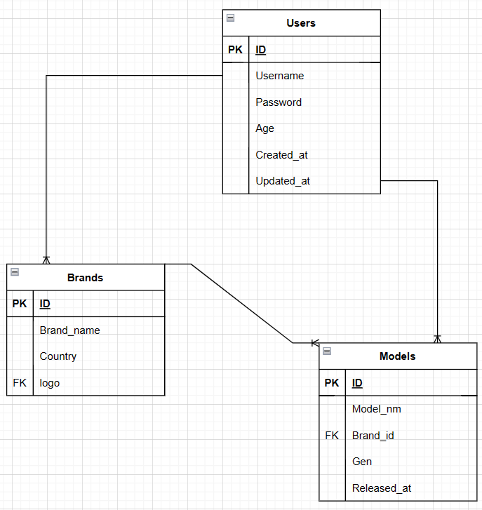
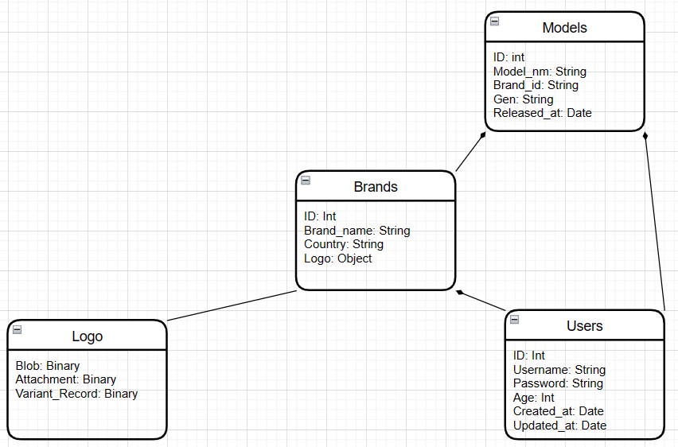

# Disclaimer

This project was prepared in conjunction with a [React FrontEnd](https://github.com/KRodVal/ReactCarFrontEnd). 
To access the directory where said backend is stored, please click [here](https://github.com/KRodVal/ReactCarFrontEnd).

Before starting the Instalation Guide, you must have installed [Ruby](https://nodejs.org/es/) and all of it's dependencies.

## API Reference

#### Brands

```http
 GET  /brands
```

| Parameter | Type     | Description                |
| :-------- | :------- | :------------------------- |
| `Token`   | `string` | **Required**. Your Token   |

#### Brand

```http
  GET /brands/${id}
```

| Parameter | Type     | Description                       |
| :-------- | :------- | :-------------------------------- |
| `id`      | `string` | **Required**. Id of brand to fetch |
| `Token`   | `string` | **Required**. Your Token          |

#### Brands

```http
 GET  /models
```

| Parameter | Type     | Description                |
| :-------- | :------- | :------------------------- |
| `Token`   | `string` | **Required**. Your Token   |

#### Brand

```http
  GET /models/${id}
```

| Parameter | Type     | Description                       |
| :-------- | :------- | :-------------------------------- |
| `id`      | `string` | **Required**. Id of model to fetch |
| `Token`   | `string` | **Required**. Your Token          |

## Diagrams

### E-R



### Relational



### UML


